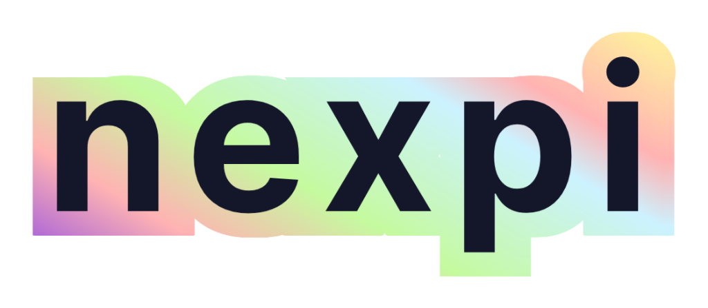

# Get Started



## Npm


```bash
npm install nexpi-ui
```

Import, in layout.tsx

```javascript
import Theme from "nexpi-ui/lib/Theme";

....

const rootLayout = ({ ...props }: LayoutProps) => {
  return (
    <html lang="en">
      <head>
        <meta charSet="UTF-8" />
        <meta name="viewport" content="width=device-width, initial-scale=1.0" />
      </head>
      <body >
        <Theme>
          {props.children}
        </Theme>
      </body>

    </html>
  );
}
 ```
 
 ## Manual


First things first, let's grab the package from the repository:

```bash
git clone https://github.com/dukesaturn/nexpi-UI
```

Next, you'll want to insert the `components` folder into the `app` folder of you app.

Import, in layout.tsx

```javascript
import Theme from "./components/Theme";


....

const rootLayout = ({ ...props }: LayoutProps) => {
  return (
    <html lang="en">
      <head>
        <meta charSet="UTF-8" />
        <meta name="viewport" content="width=device-width, initial-scale=1.0" />
      </head>
      <body >
        <Theme>
          {props.children}
        </Theme>
      </body>

    </html>
  );
}
 
```

Now, it's time to dive in and have some fun with it!
Buon divertimento! 

Dependencies:

  - ***react-icons (^5.2.1)**: A comprehensive library of icons for React.
  - **react-syntax-highlighter (^15.5.0)**: Syntax highlighting component for React.
  - **rehype-katex (^7.0.0)**: A plugin for rehype to support LaTeX math syntax in HTML.
  - **remark-math (^6.0.0)**: A remark plugin to support LaTeX math syntax in Markdown.
  - **next-themes (^0.3.0)**
  - **react-markdown (^9.0.1)**


